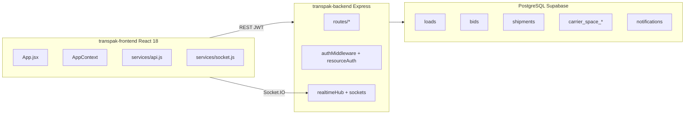

# TransPAK Master Audit — Architecture Atlas

**Generated:** 2026-06-16  
**Scope:** Production baseline `af39e03dfeba` (backend) / `08ca872e2873` (frontend), schema **032**  
**Purpose:** Phase 1 architecture map for go-live certification

---

## 1. System overview

TransPAK is a monorepo freight marketplace connecting shippers and carriers:

- **Load marketplace** — shippers post loads; carriers bid; acceptance creates shipments
- **Capacity marketplace** — carriers list truck space; shippers send space requests
- **Shipment lifecycle** — booked → picked up → in transit → delivered → closed
- **Realtime** — Socket.IO + HTTP sync fallback for notifications, bids, tracking
- **Admin** — dashboard, audit, fleet queue, verification



---

## 2. Frontend architecture

### 2.1 Bootstrap & routing

| File | Role |
|------|------|
| `transpak-frontend/src/main.jsx` | React root, providers |
| `transpak-frontend/src/App.jsx` | Router shell, `ReviewPromptHost`, deploy banners |
| `transpak-frontend/src/routes/authRoutes.jsx` | Login, register, verification |
| `transpak-frontend/src/routes/dashboardRoutes.jsx` | Shipper/carrier dashboards |
| `transpak-frontend/src/routes/commercialRoutes.jsx` | Loads, bids, shipments, capacity |
| `transpak-frontend/src/routes/adminRoutes.jsx` | Admin pages |
| `transpak-frontend/src/routes/guards.jsx` | `ProtectedRoute`, role guards |

### 2.2 State & API

| File | Role |
|------|------|
| `context/AppContext.jsx` | Notifications, socket lifecycle, workspace role, unread sync |
| `context/AuthContext.jsx` | Login/session, token storage |
| `services/api.js` | Axios client, interceptors, workspace headers |
| `services/socket.js` | Socket.IO connect, `workspace:join`, reconnect debounce |
| `services/authService.js` | Auth API wrappers |

### 2.3 Realtime (frontend)

| File | Role |
|------|------|
| `utils/realtimeDispatch.js` | Ingest `dispatch:event`, route to UI refresh + notification pipeline |
| `utils/realtimeSync.js` | `syncEventsSince` — `/operations/sync/events` with fallback |
| `utils/notificationEngine.js` | Event type → UI notification shape |
| `utils/notificationPipeline.js` | Dedupe, sound, toast |
| `utils/notificationScope.js` | Workspace filter for dual-role users |

### 2.4 Shipments & tracking

| File | Role |
|------|------|
| `hooks/useShipmentTracking.js` | REST + socket orchestration, GPS publish, status rehydration |
| `hooks/useTrackingSocket.js` | Join tracking room, emit location |
| `hooks/useTrackingCoordinator.js` | Debug/telemetry overlay only |
| `utils/activeShipmentStore.js` | Shared active shipment rows |
| `utils/shipmentStatusOptimistic.js` | Optimistic status, timeline merge, `tp:shipment-status-updated` |
| `utils/stateNormalizationEngine.js` | `getNextAllowedActions` (carrier advance buttons) |
| `pages/shipments/ShipmentTracking.jsx` | Primary tracking UI |

### 2.5 Commercial UI surfaces

| Domain | Key pages/components |
|--------|---------------------|
| Loads | `pages/loads/*`, `components/loadboard/LoadCard.jsx`, `LoadList.jsx` |
| Bids | `pages/bids/*`, `components/loadboard/BidCard.jsx`, `BidList.jsx` |
| Capacity | `components/carrier/CapacityMarketplace.jsx`, `CarrierSpaceCard.jsx`, `EditCarrierSpaceModal.jsx` |
| Reviews | `components/reviews/ReviewPromptHost.jsx`, `ReviewPromptModal.jsx` |
| Admin | `pages/admin/*`, `hooks/useAdminDashboardWidgets.js` |

---

## 3. Backend architecture

### 3.1 Server bootstrap

| File | Role |
|------|------|
| `transpak-backend/src/server.js` | HTTP listen, DB init, marketplace expiry scheduler |
| `transpak-backend/src/app.js` | Middleware stack, route mounting, `/api/health` |
| `transpak-backend/config/db.js` | Pool, `verifySchema` on connect (read-only) |
| `transpak-backend/db/schemaGuard.js` | `SCHEMA_VERSION = "032"`, column + constraint checks |

### 3.2 API route matrix

| Mount | Router | Commercial guard |
|-------|--------|------------------|
| `/api/auth` | `authRoutes` | No |
| `/api/profile` | `profileRoutes` | `forbidAdminOnlyCommercial` |
| `/api/shipments` | `shipmentRoutes` | Yes |
| `/api/loads` | `loadRoutes` | Yes |
| `/api/bids` | `bidRoutes` | Yes |
| `/api/carrier-space` | `carrierSpaceRoutes` + `spaceBookingRoutes` | Yes |
| `/api/notifications` | `notificationRoutes` | No (auth per-route) |
| `/api/reviews`, `/api/ratings` | `reviewRoutes` | Yes |
| `/api/operations` | `operationsRoutes` | Yes (snapshot, event sync) |
| `/api/admin` | `adminRoutes` | Admin session guard |
| `/api/public` | `publicRoutes` | Public stats, profiles |
| `/api/chat` | `chatRoutes` | Yes |
| `/api/trucks` | `truckRoutes` | Yes |

### 3.3 Auth & authorization

| File | Role |
|------|------|
| `middleware/authMiddleware.js` | JWT → `req.auth`, DB roles |
| `utils/resourceAuth.js` | Ownership: loads, bids, shipments, space requests, trucks |
| `middleware/forbidAdminOnlyCommercial.js` | Block platform admin from commercial APIs |
| `middleware/authorizeResource.js` | Load read/mutate middleware |

### 3.4 Lifecycle engines

| File | Role |
|------|------|
| `utils/shipmentStatus.js` | `SHIPMENT_ORDER`, `validateShipmentTransition` |
| `utils/bidAcceptance.js` | Accept bid → shipment + notifications (transactional) |
| `utils/bidStateMachine.js` | Bid status transitions |
| `utils/loadExpiry.js` | Expire open loads, cancel stale bids, scheduler |
| `utils/capacityListingLifecycle.js` | Close expired capacity listings |
| `utils/spaceRequestState.js` | Space request FSM |

### 3.5 Notifications & realtime (backend)

| File | Role |
|------|------|
| `utils/notifyEvent.js` | Insert + socket; `ON CONFLICT ON CONSTRAINT uq_notifications_receiver_dedupe_full` |
| `utils/notificationDedupeAdapter.js` | Event-safe dedupe keys |
| `utils/bidRealtime.js` | Bid accept/refresh fan-out |
| `utils/realtimeDispatch.js` | Scoped socket emit to workspace rooms |
| `utils/eventSync.js` | Reconnect catch-up payload builder |
| `services/realtimeHub.js` | Socket engine, room management |
| `sockets/index.js` | Handlers: workspace join, tracking location, entity rooms |

---

## 4. Database entities

### 4.1 Core commercial graph

```
users
  ├── loads (shipper_id) ── bids (load_id, carrier_id) UNIQUE
  │       └── shipments (load_id) UNIQUE
  ├── carrier_space_listings (carrier_id)
  │       └── carrier_space_requests (listing_id, shipper_id)
  ├── notifications (receiver_id, dedupe_key) UNIQUE full constraint
  └── ratings (shipment_id|space_request_id, from_user_id) UNIQUE
```

### 4.2 Key constraints (integrity probes)

| Constraint | Purpose |
|------------|---------|
| `bids` unique `(load_id, carrier_id)` | One active bid per carrier per load |
| `shipments` unique `load_id` | One shipment per load |
| `ratings_unique (shipment_id, from_user_id)` | One rating per party per shipment |
| `uq_notifications_receiver_dedupe_full` | Notification insert dedupe (migration 032) |

### 4.3 Schema version

- **Code:** `SCHEMA_VERSION = "032"` in `schemaGuard.js`
- **Migrations:** `027`–`032` (distributed, causal tracing, review dismiss, perf indexes, bids unique, notification dedupe)

---

## 5. Critical flow maps

### 5.1 Bid accept → shipment → notification

```
POST/PUT bid accept (bidRoutes / bidAcceptance)
  → FOR UPDATE row lock
  → INSERT shipment ON CONFLICT (load_id)
  → notifyUser BID_ACCEPTED (event dedupe key)
  → emitBidStateChange + marketplace fan-out
```

### 5.2 Shipment status advance

```
PUT /api/shipments/:ref/status (carrier)
  → validateShipmentTransition (400 if backward)
  → UPDATE shipments.status
  → notifyUser SHIPMENT_* events
  → publishTrackingEvent → socket dispatch:event
  → FE: tp:shipment-status-updated → refetch
```

### 5.3 Notification delivery

```
notifyUser (notifyEvent.js)
  → validate dedupe_key
  → INSERT ON CONFLICT ON CONSTRAINT uq_notifications_receiver_dedupe_full DO NOTHING
  → realtimeDispatch.emitDispatchEvent (workspace-scoped)
  → FE: notificationPipeline + AppContext unread
  → Fallback: GET /notifications/sync when socket disconnected
```

### 5.4 Capacity listing lock (certified: at acceptance)

```
PATCH /api/carrier-space/:id
  → LISTING_LOCKED if status != open OR engaged requests in active|in_transit|completed
DELETE /api/carrier-space/:id
  → LISTING_ACTIVE if active|in_transit requests exist
```

### 5.5 Expiry

```
startMarketplaceExpiryScheduler (server.js, ~60s)
  → runMarketplaceExpiryProcessor
      → closeExpiredCapacityListings
      → expire open loads past deadline → cancelled
      → expireBidsOnNonOpenLoads
```

---

## 6. Validation harness (audit tooling)

| Script | Purpose |
|--------|---------|
| `scripts/gate-schema-policy.mjs` | Dynamic schema >= check |
| `scripts/release-gate-probe.mjs` | 24 live production checks |
| `scripts/gap-audit-regression.mjs` | 12-step orchestrator |
| `transpak-backend/scripts/db-integrity-check.mjs` | Duplicate/orphan SQL |
| `transpak-backend/scripts/notification-*-gate.mjs` | Notification certification |
| `transpak-backend/test/*.test.js` | 44 unit/integration test files |

---

## 7. Production vs local workspace

| | Production | Local workspace |
|---|------------|-----------------|
| Backend SHA | `af39e03dfeba` | ~157 modified + ~142 untracked vs HEAD `2a285752` |
| Frontend SHA | `08ca872e2873` | Same delta |
| Schema | 032 live | schemaGuard 032 in workspace |

**Audit rule:** Functional PASS/FAIL for LIVE uses production probes; LOCAL_DELTA items flagged separately in certification report.
